# Proposal Hatter — v0.1.0

A Hats Protocol-powered governance contract for proposals that create roles, assign authorities, and allocate funding through. Specifically, proposals can create, modify, and issue [Hats Protocol hats](https://github.com/hats-protocol/hats-protocol) as well as grant to a hat the permission to withdraw funds from a vault.

The authority to propose, decide (i.e., approve, reject, or escalate), and execute are hats, and can therefore be customized with the organization's preferred logic and modularly adjusted over time without changing the core proposal system. Each proposal is tied to a single-use Approver hat, enabling flexible and effectiveness-cost-hardness-optimal matching of decision-maker(s) to each decision as well as concurrent proposals and without limiting decision-making bandwidth.

## Functionality
All organizational operational decisions are modeled as the creation of, modification to, and/or issuance of roles/hats. This includes delegation and revocation of responsibilities, funding / authorities / permissions / access rights, alignment and incentive mechanisms, qualification criteria, decision-making rules, and constraints. Funding is modeled as "just another" permission attached to a hat.

**Deterministic proposals** that bind a Hats `multicall` payload, a funding source (the vault; a Safe), the funding recipient hat, and an allowance ledger entry. The multicall may include any Hats Protocol public functions that create, modify, or issue hats that are children/descendants of the hat worn by ProposalHatter itself.

**Per-proposal Approver hats** are created for each new proposal and deactivated after the approver's job is done — i.e., after the proposal has been approved, rejected, canceled, or escalated. Minting the Approver hat is an external process managed by a modular admin, e.g. an accountable committee, a trusted fiduciary, or an aligned/verifiable AI agent. This — together with the option to reserve hat namespace — enables concurrent proposals with no execution queue.

**Pull-based funding** enables Approver flexibility (and therefore better decision-maker : decision matching) without impacting security. All funds remain in the organization-controlled vault until withdrawn by the approved recipient. The vault is a Safe with Proposal Hatter enabled as a module.
- Safe module withdrawals (`execTransactionFromModuleReturnData`) so recipients pull funds once a proposal is executed.

**Partial withdrawals** are allowed, enabling recipients to modularly commit to period-, milestone-, or condition-based funding schedules without imposing additional complexity on the core system.

The Owner hat wearer (i.e., the organization) can globally pause proposals and withdrawals, set new role hats, and migrate to a new vault Safe.

### Proposal Lifecycle Summary
1. **Propose** – Proposer hat wearer calls `propose` with funding, Hats payload, timelock, recipient hat, and optional reserved hat. Contract creates a single-use Approver hat.
2. **Approve** – Approver hat wearer approves the proposal, setting `eta = now + timelock`. Approver hat is toggled off immediately.
3. **Execute** – Executor hat wearer (or anyone if execution is public) runs `execute` after `eta`. Hats multicall runs atomically, allowance is credited, and proposal becomes immutable.
4. **Escalate/Reject/Cancel** – Escalator hat can halt execution, with a social signal to re-submit the proposal to a higher level of the organization, e.g., a DAO's token voters. Approver hat can reject; submitter can cancel. Reserved hats are toggled off on reject or cancel.
5. **Withdraw** – Recipient hat wearer pulls native coins (e.g. ETH) or ERC20 tokens from the Safe via ProposalHatter; ERC‑20 transfers follow OZ SafeERC20 patterns and revert on bad return data.

```mermaid
%%{init: {'theme':'base', 'themeVariables': { 'primaryColor':'#e3f2fd','primaryTextColor':'#000','primaryBorderColor':'#1976d2','lineColor':'#1976d2','secondaryColor':'#f3e5f5','tertiaryColor':'#fff3e0'}}}%%
flowchart TD
    Start([Someone has an idea<br/>for a new role or funding]) --> Submit[📝 Submit Proposal]

    Submit --> Create[✅ Proposal Created<br/>Approver hat assigned]

    Create --> Review{Approver Reviews}

    Review -->|👍 Approve| Wait[⏳ Timelock Period<br/>Safety delay]
    Review -->|👎 Reject| Rejected[❌ Rejected<br/>Proposal ends]
    Review -->|🚫 Cancel| Canceled[🚫 Canceled<br/>Proposal ends]
    Review -->|🚨 Escalate| Escalated[⚠️ Escalated<br/>Sent to higher governance]

    Wait --> Execute[⚙️ Execute Proposal<br/>Roles created<br/>Funding unlocked]
    Wait -->|🚨 Escalate| Escalated
    Wait -->|🚫 Cancel| Canceled

    Execute --> Withdraw[💰 Recipient Withdraws<br/>Can take funds in parts]

    Withdraw --> Done([✓ Complete])
    Rejected --> End([Proposal Finished])
    Canceled --> End
    Escalated --> End

    style Submit fill:#c8e6c9,stroke:#81c784,color:#1b5e20
    style Review fill:#ffe0b2,stroke:#ffb74d,color:#e65100
    style Execute fill:#bbdefb,stroke:#64b5f6,color:#0d47a1
    style Withdraw fill:#e1bee7,stroke:#ba68c8,color:#4a148c
    style Rejected fill:#ffcdd2,stroke:#e57373,color:#b71c1c
    style Escalated fill:#fff9c4,stroke:#fff176,color:#f57f17
    style Canceled fill:#e0e0e0,stroke:#bdbdbd,color:#424242
```



### Hats & Configuration
- `OWNER_HAT` — admin functions, pause toggles, and role updates.
- `proposerHat`, `executorHat` (or `PUBLIC_SENTINEL`), `escalatorHat` — operational roles adjustable by owner.
- Per-proposal Approver hat (under `APPROVER_BRANCH_ID`) — minted during `propose`.
- Optional reserved branch hat (under `OPS_BRANCH_ID`) — allows proposal-specific hat namespace.
- Allowances are keyed by `(safe, recipientHatId, token)`.

### Reserving Hat Namespace
Proposers can optionally specify a `reservedHatId` to be created along with proposal submission. Reserving the hat id namespace that a proposal may rely on for successful execution of its Hats `multicall` payload enables multiple concurrent proposals to proceed at their own pace without creating hat id namespace collisions or other related issues.

Proposers can use the `removeReservedHatFromMulticall` utility to clean out the `createHat` call from a set of calls generated via the [Hats App](https://app.hatsprotocol.xyz).

If a proposal is rejected or canceled, its unused `reservedHatId` is toggled off to keep the Hats tree clean.

## Contract Surface
- `src/ProposalHatter.sol` — single production contract (AGPL-3.0).
- `src/interfaces/` — type, error, and event interfaces plus minimal multicall helper.
- `src/lib/` — hat ID utilities and hashing helpers.
- Tests under `test/` use Mainnet forked Hats protocol & Safe v1.4.1 to cover lifecycle, view helpers, multicall validation, withdrawals, and admin setters.

## Design Considerations — v0.1.0

This version optimizes for security, simplicity, and cost of front end interface development. It makes several tradeoffs to achieve those goals. For complete details on v0.1.0 design decisions and deferred features, see [Non-goals (v0.1.0)](docs/spec.md#12-nongoals-v010) in the functional specification.

## Development Workflow
1. Install [Foundry](https://book.getfoundry.sh/getting-started/installation) and run `forge install`.
2. Copy `example.env` to `.env`, populate RPC URLs (`QUICKNODE_MAINNET_RPC` or similar) and `PRIVATE_KEY` when broadcasting.
3. Compile with `forge build` (default profile uses 0.8.30, `optimizer_runs = 1_000_000`, `bytecode_hash = none` for deterministic CREATE2).
4. Optional: `FOUNDRY_PROFILE=optimized forge build` generates via-IR bytecode in `optimized-out/`.

### Testing
- Mainnet fork tests require a funded RPC URL: `forge test`.
- Use profiles for faster runs: `FOUNDRY_PROFILE=lite forge test` for quick checks, `FOUNDRY_PROFILE=ci forge test` for deep fuzzing.
- Coverage reports: `forge coverage`.
- Gas reports are enabled globally; view with `forge test --gas-report`.

## Deployment
- Script: `script/Deploy.s.sol`.
- Deterministic deployment via CREATE2 (salt and constructor args stored in script). Example:
  ```sh
  forge script script/Deploy.s.sol -f mainnet --broadcast --verify
  ```
- Ensure Proposal Hatter is admin for the configured Hats branches and enabled as a module on the Safe post-deployment.

## Security Notes
- No funds are directly custodied in Proposal Hatter.
- Safe module calls are limited to native coin or ERC20 token transfer calls; no delegatecalls or arbitrary calls are allowed.
- ERC‑20 handling reverts on malformed or false returns, treats empty return as success.
- Withdrawal allowances are per-safe and unaffected by changing the global Safe address.
- Pauses halt proposals or withdrawals independently. Safe owners can instantly disable withdrawals by disabling the Proposal Hatter as a Safe module. The Owner hat wearer can instantly disable execution of Hats `multicall`s by revoking the Proposal Hatter's hat.
- See `docs/spec.md` for the complete functional spec, state machine, and threat model.

## FAQs

### Can multiple proposals run at the same time?
**Yes!** Each proposal has its own approver hat and optional reserved namespace, so they don't interfere with each other.

### What if the approver doesn't respond?
The **escalator** can halt the proposal and send it to a higher governance level (like full DAO vote).

### Can recipients take all the money at once?
**No** - they can only withdraw up to the approved amount, and can take it in parts based on milestones or needs.

### What's the "timelock" for?
A safety delay (e.g., 3 days) after approval and before execution, giving time to catch mistakes or escalate if needed.

### Who controls everything?
The **Owner Hat** (typically the DAO itself) can pause the system, update roles, and make admin changes.


## References
- Functional spec: `docs/spec.md`
- Solidity contract: `src/ProposalHatter.sol`
- Deployment script: `script/Deploy.s.sol`
- Hats Protocol: `https://github.com/hats-protocol/hats-protocol`
- Hats App: `https://app.hatsprotocol.xyz`
